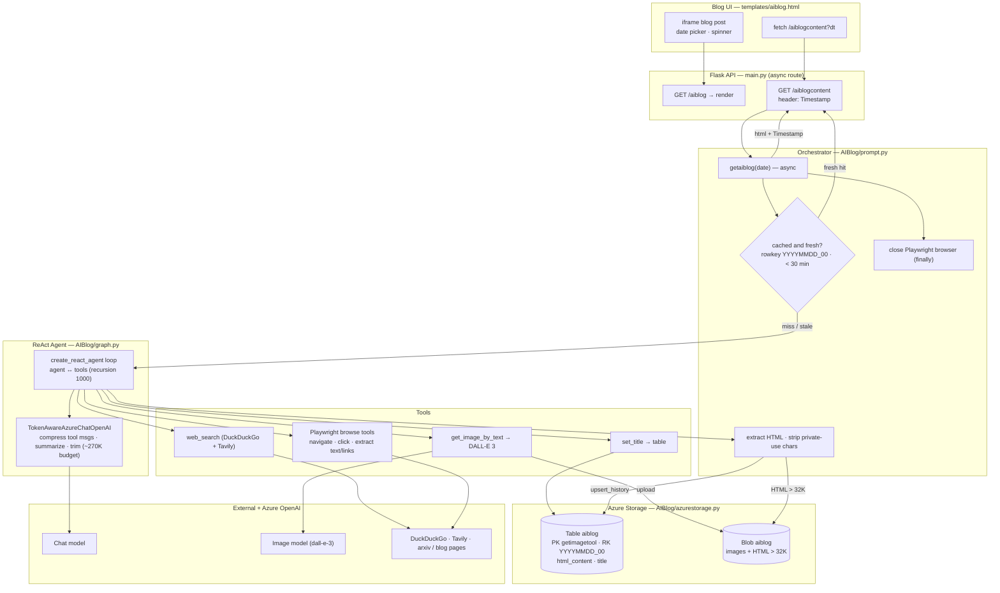
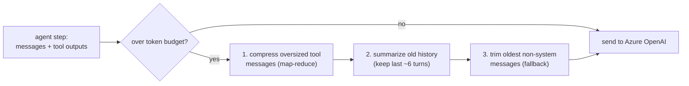
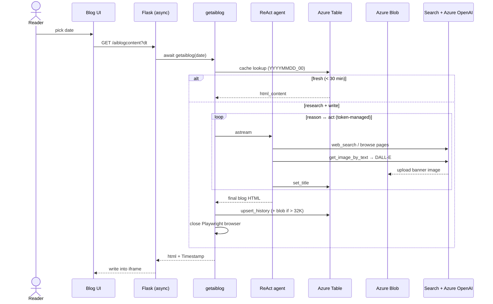

# AI Blog — Technical Flow

End-to-end architecture of AIBlog: an autonomous researcher that discovers new ML/GenAI work,
browses sources, and publishes a daily HTML blog post with a generated banner. Built on a
**LangGraph ReAct agent** with token-aware context management. (Renders on GitHub, Mermaid
Live, and most Markdown viewers.)

## System flow

## Token-aware context control

## Runtime sequence

### Notes
- **Async route + Playwright:** `/aiblogcontent` is an async Flask route; the agent browses
  real pages with Playwright, and the browser is closed in a `finally` block to avoid
  "event loop is closed" errors when Flask tears down.
- **Token-aware LLM:** `TokenAwareAzureChatOpenAI` keeps the context under budget by
  compressing large tool outputs, summarizing old turns, then trimming — so long research
  sessions don't overflow the context window.
- **Topic dedup:** the last ~30 published titles are passed in so the agent picks something new.
- **Research stack:** DuckDuckGo + Tavily search (`TAVILY_API_KEY`) plus Playwright browsing
  of arxiv / vendor blogs; a DALL-E 3 banner is generated and stored in blob.
- **Storage:** one post per day (`YYYYMMDD_00`) in the `aiblog` table; HTML over 32K chars and
  all images live in the `aiblog` blob container. `DEBUG` / `DEBUG_SAVE` flags control the
  cache and whether output is persisted.
