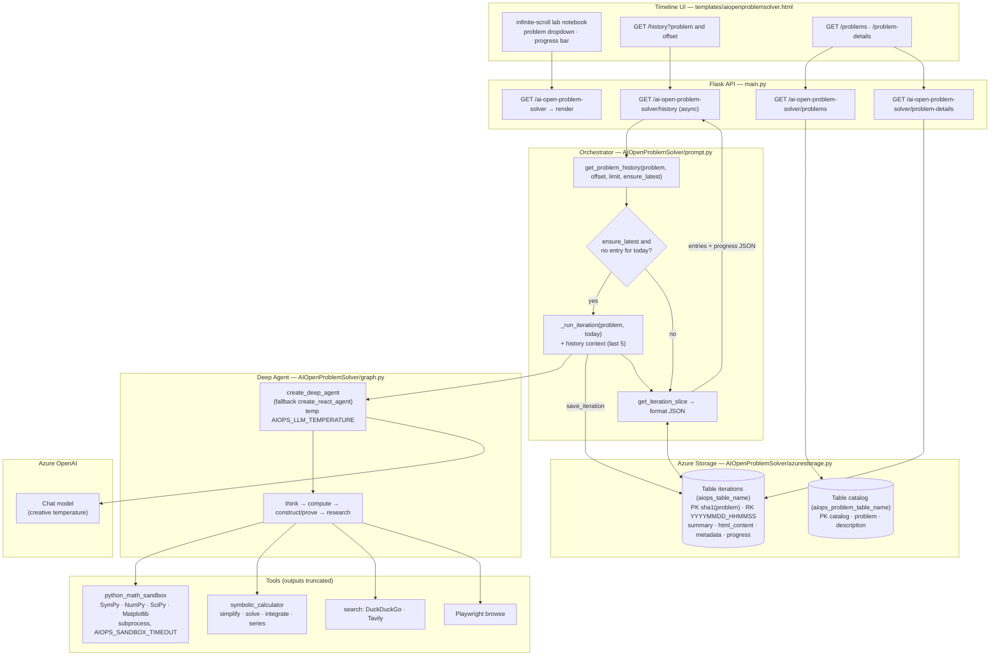
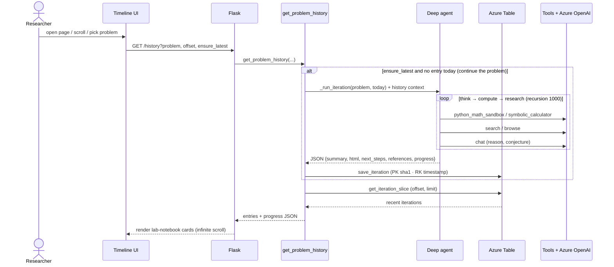

# AI Open Problem Solver — Technical Flow

End-to-end architecture of the AI Open Problem Solver: an autonomous mathematician that, each
day, advances an open problem (e.g. the Riemann Hypothesis) by computing, conjecturing, and
researching — recording each iteration as an HTML lab-notebook entry. Built on **deepagents /
LangGraph** with a Python math sandbox. (Renders on GitHub, Mermaid Live, and most Markdown
viewers.)

## System flow

## Runtime sequence — read vs. generate

### Notes
- **Read vs. generate:** browsing history is a cheap table read. A **new iteration runs only
  when** `ensure_latest=true` and there is no entry for today — this is the resume/continue
  mechanism, so the agent advances the *same* problem instead of restarting.
- **Deep agent:** built with **deepagents** (`create_deep_agent`), falling back to a classic
  LangGraph **ReAct** agent. Priority is THINK → COMPUTE → CONSTRUCT/PROVE → RESEARCH; tool
  outputs are truncated (`AIOPS_TOOL_MAX_CHARS`) to protect the context window.
- **Math sandbox:** `python_math_sandbox` executes code in a **subprocess** (timeout
  `AIOPS_SANDBOX_TIMEOUT`) with SymPy/NumPy/SciPy/Matplotlib pre-imported; `symbolic_calculator`
  handles quick SymPy operations.
- **Structured output:** each iteration is parsed JSON — `summary`, `html_content` (the
  lab-notebook entry), `next_steps`, `references`, and a clamped `progress_percent` /
  `progress_comment` that drives the UI progress bar.
- **Two tables:** **iterations** (per problem, keyed by timestamp) and a **problem catalog**
  (the dropdown registry). A blob container exists (`aiops_blob_name`) but is currently unused.
- **Creativity:** a higher LLM temperature (`AIOPS_LLM_TEMPERATURE`, default 0.8) encourages
  novel mathematical approaches across iterations.
