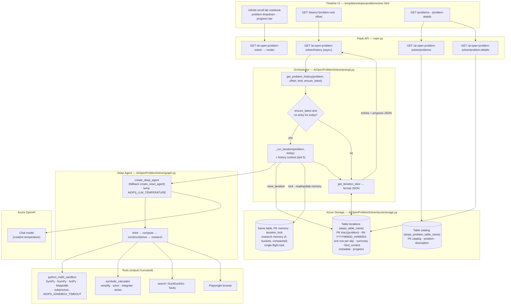
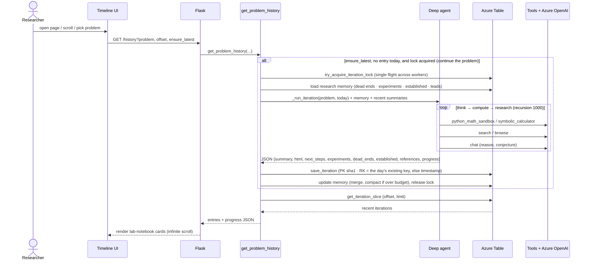

# AI Open Problem Solver — Technical Flow

End-to-end architecture of the AI Open Problem Solver: an autonomous mathematician that, each
day, advances an open problem (e.g. the Riemann Hypothesis) by computing, conjecturing, and
researching — recording each iteration as an HTML lab-notebook entry. Built on **deepagents /
LangGraph** with a Python math sandbox. (Renders on GitHub, Mermaid Live, and most Markdown
viewers.)

## System flow

```mermaid
flowchart TB
  subgraph BROWSER["Timeline UI — templates/aiopenproblemsolver.html"]
    direction TB
    TUI["infinite-scroll lab notebook<br/>problem dropdown · progress bar"]
    TH["GET /history?problem and offset"]
    TP["GET /problems · /problem-details"]
  end

  subgraph API["Flask API — main.py"]
    direction TB
    R0["GET /ai-open-problem-solver → render"]
    RH["GET /ai-open-problem-solver/history (async)"]
    RPB["GET /ai-open-problem-solver/problems"]
    RPD["GET /ai-open-problem-solver/problem-details"]
  end

  subgraph ORCH["Orchestrator — AIOpenProblemSolver/prompt.py"]
    direction TB
    GPH["get_problem_history(problem, offset, limit, ensure_latest)"]
    ELI{"ensure_latest and<br/>no entry for today?"}
    RUN["_run_iteration(problem, today)<br/>+ history context (last 5)"]
    SLICE["get_iteration_slice → format JSON"]
  end

  subgraph AGENT["Deep Agent — AIOpenProblemSolver/graph.py"]
    direction TB
    DA["create_deep_agent<br/>(fallback create_react_agent)<br/>temp AIOPS_LLM_TEMPERATURE"]
    LOOPN["think → compute → construct/prove → research"]
  end

  subgraph TOOLS["Tools (outputs truncated)"]
    direction TB
    SB["python_math_sandbox<br/>SymPy · NumPy · SciPy · Matplotlib<br/>subprocess, AIOPS_SANDBOX_TIMEOUT"]
    SC["symbolic_calculator<br/>simplify · solve · integrate · series"]
    SR["search: DuckDuckGo · Tavily"]
    BR["Playwright browse"]
  end

  subgraph STORE["Azure Storage — AIOpenProblemSolver/azurestorage.py"]
    TIT[("Table iterations (aiops_table_name)<br/>PK sha1(problem) · RK YYYYMMDD_HHMMSS<br/>one row per day · summary · html_content<br/>metadata · progress")]
    TMEM[("Same table, PK memory · iteration_lock<br/>research memory (4 buckets, compacted)<br/>single-flight lock")]
    TCAT[("Table catalog (aiops_problem_table_name)<br/>PK catalog · problem · description")]
  end

  subgraph AZ["Azure OpenAI"]
    CHAT["Chat model<br/>(creative temperature)"]
  end

  TUI --> R0
  TH --> RH
  TP --> RPB
  TP --> RPD
  RPB --> TCAT
  RPD --> TIT

  RH --> GPH --> ELI
  ELI -->|yes| RUN
  ELI -->|no| SLICE
  RUN --> DA --> LOOPN
  LOOPN --> SB
  LOOPN --> SC
  LOOPN --> SR
  LOOPN --> BR
  DA --> CHAT
  RUN -->|save_iteration| TIT
  RUN -->|"lock · read/update memory"| TMEM
  RUN --> SLICE
  SLICE <--> TIT
  SLICE -->|entries + progress JSON| RH
```

## Runtime sequence — read vs. generate

```mermaid
sequenceDiagram
    actor U as Researcher
    participant UI as Timeline UI
    participant API as Flask
    participant P as get_problem_history
    participant AG as Deep agent
    participant T as Azure Table
    participant X as Tools + Azure OpenAI

    U->>UI: open page / scroll / pick problem
    UI->>API: GET /history?problem, offset, ensure_latest
    API->>P: get_problem_history(...)
    alt ensure_latest, no entry today, and lock acquired (continue the problem)
        P->>T: try_acquire_iteration_lock (single flight across workers)
        P->>T: load research memory (dead ends · experiments · established · leads)
        P->>AG: _run_iteration(problem, today) + memory + recent summaries
        loop think → compute → research (recursion 1000)
            AG->>X: python_math_sandbox / symbolic_calculator
            AG->>X: search / browse
            AG->>X: chat (reason, conjecture)
        end
        AG-->>P: JSON {summary, html, next_steps, experiments, dead_ends, established, references, progress}
        P->>T: save_iteration (PK sha1 · RK = the day's existing key, else timestamp)
        P->>T: update memory (merge, compact if over budget), release lock
    end
    P->>T: get_iteration_slice (offset, limit)
    T-->>P: recent iterations
    P-->>API: entries + progress JSON
    API-->>UI: render lab-notebook cards (infinite scroll)
```

### Notes
- **Read vs. generate:** browsing history is a cheap table read. A **new iteration runs only
  when** `ensure_latest=true` and there is no entry for today — this is the resume/continue
  mechanism, so the agent advances the *same* problem instead of restarting.
- **Gaps are inherent, and harmless here.** Nothing schedules the iterations, so days the app was
  down simply have no entry. The timeline is a paginated list of the entries that exist (never a
  calendar walk), `_recent_summaries` and the memory seed both read the last N *existing* rows,
  and only today ever generates — so a week of downtime costs a week of research and nothing else.
  No date arithmetic anywhere assumes yesterday exists.
- **One entry per day, enforced three ways.** An iteration takes minutes and is triggered from
  a *blocking* request, so concurrent visitors across the 4 gunicorn workers used to each start
  their own run and the day ended up with several notebook entries. Now: (1) a cross-worker
  **single-flight lock** (`iteration_lock` partition, TTL `AIOPS_ITERATION_LOCK_TTL`, re-checked
  inside the lock) means losers of the race serve the existing history instead of generating;
  (2) the save **reuses the RowKey the day already has** (`rowkey_for_date`), so a re-run
  replaces the day's entry rather than appending one; (3) `get_iterations` **collapses each
  calendar day to its latest row** on read, which repairs the dates that were duplicated before
  the lock existed without deleting anything.
- **Research memory (`AIOpenProblemSolver/memory.py`):** the agent starts every day with a fresh
  context, so a rolling window of summaries is not enough to stop it re-running yesterday's
  experiment — summaries say what was *achieved*, and what prevents wasted work is the record of
  what was **tried and failed**. Each iteration folds its report into a per-problem memory
  document (`memory` partition) with four buckets — `dead_ends`, `experiments`, `established`,
  `open_leads` — deduplicated stamp-, case- and punctuation-insensitively. It is rendered into
  the system prompt anti-repetition-first, with explicit rules forbidding the agent from redoing
  a listed experiment or failed approach. The agent's JSON output gained `experiments`,
  `dead_ends` and `established` keys to feed it; all are read with `.get`, so a model that omits
  them degrades instead of breaking.
- **Memory compaction:** the document only grows, so once it passes `AIOPS_MEMORY_MAX_ITEMS`
  (80) or `AIOPS_MEMORY_MAX_CHARS` (12k) an LLM pass merges near-duplicate entries — required to
  *enumerate* the specific ranges/variants it merges, since a merged entry that loses the
  specifics no longer answers "did I already run this?". A compaction that returns nothing, drops
  every dead end, or collapses 8+ dead ends into fewer than 3 is **rejected** as a summary rather
  than a compaction, and a deterministic per-bucket trim (dead ends and established results
  survive longest) runs instead — so memory stays bounded even when the model is unavailable.
  The whole memory path is best-effort and never raises into the iteration that produced it.
- **Deep agent:** built with **deepagents** (`create_deep_agent`), falling back to a classic
  LangGraph **ReAct** agent. Priority is THINK → COMPUTE → CONSTRUCT/PROVE → RESEARCH; tool
  outputs are truncated (`AIOPS_TOOL_MAX_CHARS`) to protect the context window.
- **Math sandbox:** `python_math_sandbox` executes code in a **subprocess** (timeout
  `AIOPS_SANDBOX_TIMEOUT`) with SymPy/NumPy/SciPy/Matplotlib pre-imported; `symbolic_calculator`
  handles quick SymPy operations.
- **Structured output:** each iteration is parsed JSON — `summary`, `html_content` (the
  lab-notebook entry), `next_steps`, `references`, and a clamped `progress_percent` /
  `progress_comment` that drives the UI progress bar.
- **Two tables:** **iterations** (per problem, keyed by timestamp) and a **problem catalog**
  (the dropdown registry). A blob container exists (`aiops_blob_name`) but is currently unused.
- **Creativity:** a higher LLM temperature (`AIOPS_LLM_TEMPERATURE`, default 0.8) encourages
  novel mathematical approaches across iterations.
