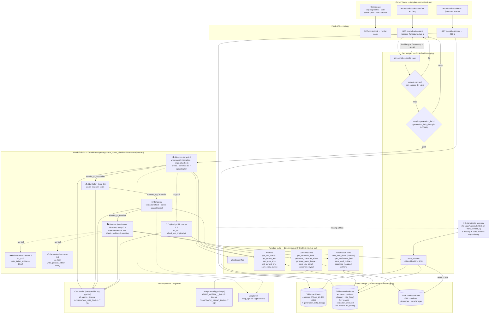
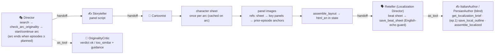
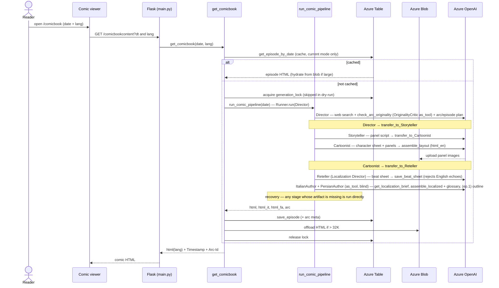

# ComicBook — Technical Flow

End-to-end architecture of ComicBook: a daily, multi-agent AI comic strip with dynamic story
arcs, character consistency, and en/it/fa editions. Built on the **OpenAI Agents SDK** and
orchestrated as a **handoff chain** — Director → Storyteller → Cartoonist → Reteller — with a
deterministic recovery fallback so a missed handoff never strands a comic.
(Renders on GitHub, Mermaid Live, and most Markdown viewers.)

## System flow

## Handoff chain + consistency

Each handoff uses `input_filter=remove_all_tools`, so the next agent inherits the plan/script
**messages** but not the previous stage's tool-call noise. Every chained agent is wrapped with
`prompt_with_handoff_instructions(...)` so it reliably calls its `transfer_to_<next>` tool.

## Runtime sequence

### Notes

- **Orchestration = handoff chain + recovery.** `run_comic_pipeline` is a single
  `Runner.run(Director)`; control flows by SDK handoffs Director → Storyteller → Cartoonist →
  Reteller. The Cartoonist is hard-gated to finish `assemble_layout` before it may transfer.
  Because LLMs don't always call their transfer tool, a **deterministic recovery** runs any stage
  whose artifact (`html_en` / `html_it` / `html_fa`) is missing in `state` directly with a clean
  input — so the comic always completes.
- **Originality (three-layer guard).** New arcs are kept fresh by: (1) the Director's prompt
  mandates web search and a candidate→check→retry loop; (2) `check_arc_originality` is the
  **OriginalityCritic** agent exposed via `as_tool` (it reads recent arcs with `get_recent_arcs`
  and returns `ok`/`too_similar` + guidance); (3) `start_new_arc` refuses an art style that
  collides with a recent arc. The Director is the creative engine (temp 1.2); the Storyteller is
  cool (temp 0.5) so it faithfully executes the plan.
- **No LLM calls inside tools.** A `@function_tool` only does deterministic work (storage,
  assembly, image generation, string logic). Anything that reasons with the model is an Agent,
  reached via `as_tool` or a handoff.
- **Character consistency.** The Cartoonist generates one **character reference sheet** per arc
  (cached on the arc), then draws each panel sequentially with references (sheet → mid-arc key
  panels → prior-episode anchors) via Azure OpenAI image editing.
- **Multi-language (blind native authors).** English is native. The **Reteller** is the
  **Localization Director**: it reads the English plan/script and distills a language-neutral
  **beat sheet** (per panel: what the art depicts, each speaker's intent/emotion, `must_land`
  plot facts). `save_beat_sheet` deterministically **rejects** any sheet that echoes the English
  script's wording (6-word n-gram check, speaker names whitelisted). The **ItalianAuthor** and
  **PersianAuthor** are invoked via `as_tool` with a fresh context — they NEVER see English
  dialogue, only the beat sheet via `get_localization_brief` (panel grid + native outline +
  glossary; the English outline is exposed only on episode 1 for `save_local_outline`), and
  assemble their edition with `assemble_localized`. This firewall exists because writers who
  could see the English wording produced literal translations. A per-language **glossary** keeps
  names/terms consistent; the same panel images are reused.
- **Consistent localized title.** The localized **main title comes from the ARC** (stored once as
  `title_{lang}` and reused every episode); each native author's per-episode title is shown as a
  **subtitle** under it. Backward compatible (old episodes keep their HTML).
- **Readability guard.** `_assemble_html` runs the resolved color theme through a contrast check;
  any text color that doesn't contrast with its box (caption, recap, speech bubble, title, teaser)
  is auto-flipped to near-black/near-white — never light-on-light or dark-on-dark.
- **Caching + single-flight lock.** One episode per date is cached; `generation_lock` prevents
  concurrent regeneration (TTL-guarded). In `DEBUG` it uses `generation_lock_debug`; in a dry run
  it is skipped entirely.
- **DEBUG / DEBUG_SAVE (local testing).** `DEBUG=true` isolates all arc reads/writes to an
  `arc_debug` partition (debug arcs get `debugarc_*` ids) so production comics are never read or
  touched; `DEBUG_SAVE=false` skips all persistence (pure dry run). Production (`DEBUG` unset)
  always persists. Cross-partition reads (`get_episode_by_date`, `get_episode_index`) filter to
  the current mode.
- **No generation time limit.** The chat and image clients use a 1-hour timeout (overridable via
  `COMICBOOK_LLM_TIMEOUT` / `COMICBOOK_IMAGE_TIMEOUT`) matching the gunicorn request budget, so a
  slow-but-successful generation is never cut off.
- **Blob offload.** HTML / outlines / glossaries over 32K chars are stored in blob with the name
  kept in the table; panel images live in the same `comicbook-html` container.
- **Code layout.** Pure helpers live in `ComicBook/helpers.py`; the `@function_tool`s in
  `ComicBook/tools/agent_tools.py` (`build_comic_tools(state, target_date)` — closures over the
  pipeline's mutable `state`); image generation in `ComicBook/tools/getimage.py`; prompts, agent
  definitions and `run_comic_pipeline` in `ComicBook/agents.py`; orchestration/caching/lock in
  `ComicBook/prompt.py`.
- **Separate deployments.** Chat (configurable, e.g. `gpt-5.4`) for the agents; image (`gpt-image`)
  via the `AZURE_OPENAI_*_DALLE` resource. LangSmith traces the run (`wrap_openai` + `@traceable`).
