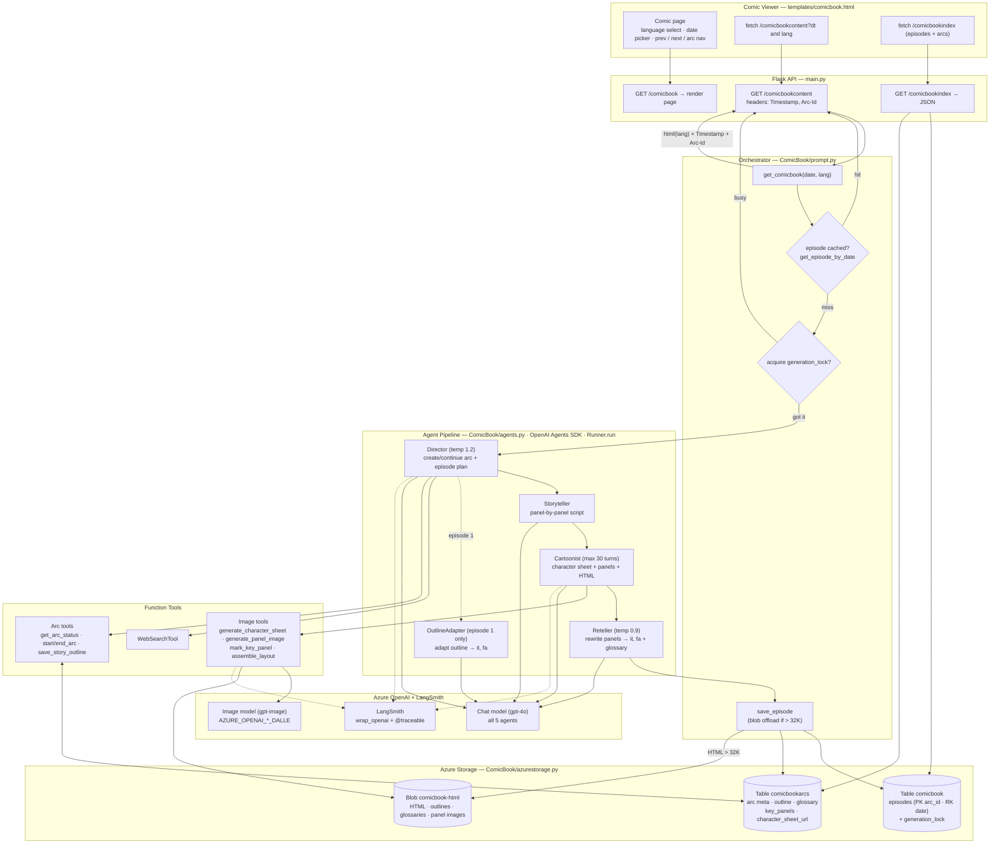
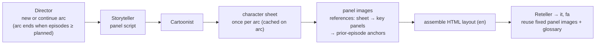
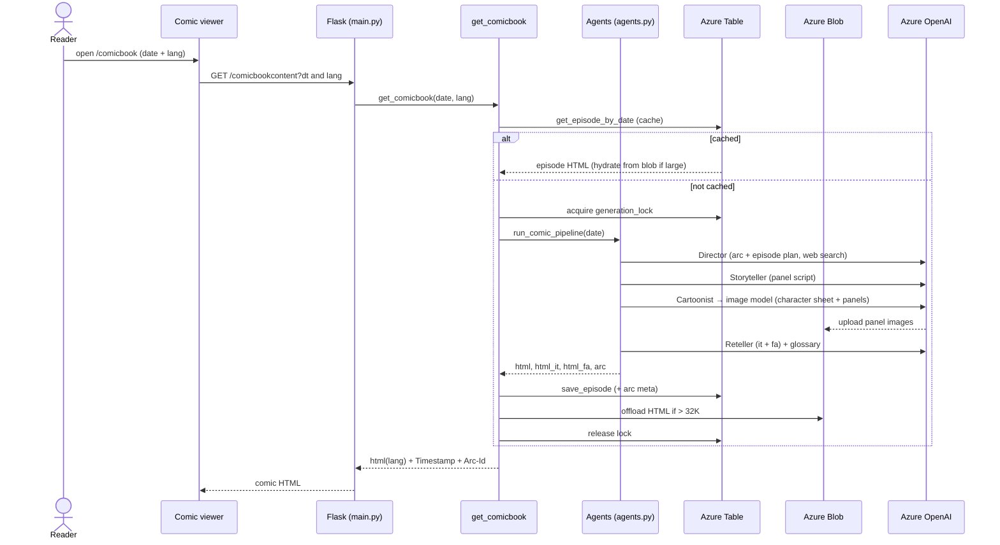

# ComicBook — Technical Flow

End-to-end architecture of ComicBook: a daily, multi-agent AI comic strip with dynamic
story arcs, character consistency, and en/it/fa editions. Built on the **OpenAI Agents SDK**.
(Renders on GitHub, Mermaid Live, and most Markdown viewers.)

## System flow

## Agent pipeline + consistency

## Runtime sequence

### Notes
- **Dynamic arcs:** the Director invents and ends story arcs organically (an arc runs as
  many episodes as it needs), tracked in the `comicbookarcs` table.
- **Character consistency:** the Cartoonist generates one **character reference sheet** per
  arc, then draws every panel with references (sheet → mid-arc key panels → prior-episode
  anchors) via Azure OpenAI image editing.
- **Multi-language:** English is native; **OutlineAdapter** (episode 1) localizes the story
  outline and **Reteller** rewrites each episode's panels into it/fa, with a per-language
  **glossary** for consistent names/terms. The same panel images are reused across languages.
- **Caching + single-flight lock:** one episode per date is cached; `generation_lock`
  (a partition in the episodes table, TTL-guarded) prevents concurrent regeneration.
- **Blob offload:** HTML / outlines / glossaries over 32K chars are stored in blob, with the
  name kept in the table; panel images live in the same `comicbook-html` container.
- **Separate deployments:** chat (`gpt-4o`) for the agents, image (`gpt-image`) via the
  `AZURE_OPENAI_*_DALLE` resource. LangSmith traces the run (`wrap_openai` + `@traceable`).
