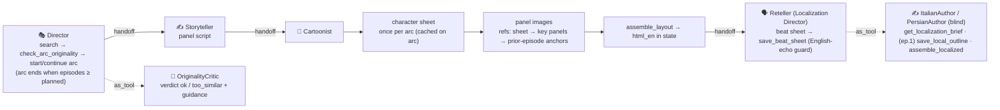
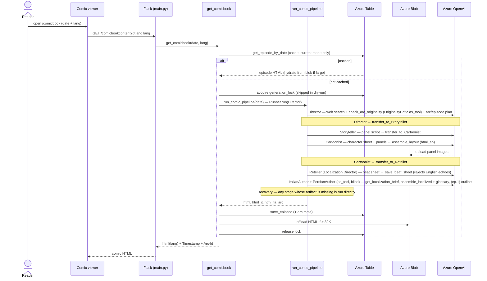

# ComicBook — Technical Flow

End-to-end architecture of ComicBook: a daily, multi-agent AI comic strip with dynamic story
arcs, character consistency, and en/it/fa editions. Built on the **OpenAI Agents SDK** and
orchestrated as a **handoff chain** — Director → Storyteller → Cartoonist → Reteller — with a
deterministic recovery fallback so a missed handoff never strands a comic.
(Renders on GitHub, Mermaid Live, and most Markdown viewers.)

## System flow

```mermaid
flowchart TB
  subgraph BROWSER["Comic Viewer — templates/comicbook.html"]
    direction TB
    CV["Comic page<br/>language select · date picker · prev / next / arc nav"]
    CFETCH["fetch /comicbookcontent?dt and lang"]
    CIDX["fetch /comicbookindex (episodes + arcs)"]
  end

  subgraph API["Flask API — main.py"]
    direction TB
    RC["GET /comicbook → render page"]
    RCC["GET /comicbookcontent<br/>headers: Timestamp, Arc-Id"]
    RCI["GET /comicbookindex → JSON"]
  end

  subgraph ORCH["Orchestrator — ComicBook/prompt.py"]
    direction TB
    GC["get_comicbook(date, lang)"]
    CACHE{"episode cached?<br/>get_episode_by_date"}
    LOCK{"acquire generation_lock?<br/>(generation_lock_debug in DEBUG)"}
    SAVE["save_episode<br/>(blob offload if > 32K)"]
  end

  subgraph PRE["Pre-chain — runs deterministically when arc is None or a restyle is requested"]
    direction TB
    AD["🎨 ArtDirector · temp 1.2<br/>web-search a production tradition<br/>commit_style_card → StyleCard for the arc"]
    SF["🔬 StyleForensics · temp 0.2<br/>sees ONLY the sheet image — blind cataloguer"]
    SA["⚖️ StyleAuditor · temp 0.1<br/>sees the two cards, NEVER the image<br/>pass / fail + intensified directive"]
  end

  subgraph PIPE["Handoff chain — ComicBook/agents.py · run_comic_pipeline · Runner.run(Director)"]
    direction TB
    DIR["🎭 Director · temp 1.2<br/>web-search inspiration · originality check<br/>create / continue arc + episode plan<br/>(art style is ASSIGNED, not chosen)"]
    OC["🔎 OriginalityCritic · temp 0.2<br/>(as_tool: check_arc_originality)"]
    ST["✍️ Storyteller · temp 0.5<br/>panel-by-panel script"]
    CART["🎨 Cartoonist<br/>character sheet · panels · assemble (en)"]
    RET["🗣️ Reteller (Localization Director) · temp 0.3<br/>language-neutral beat sheet · no English wording"]
    IA["✍️ ItalianAuthor · temp 0.9<br/>(as_tool: write_italian_edition — blind)"]
    PA["✍️ PersianAuthor · temp 0.9<br/>(as_tool: write_persian_edition — blind)"]
    DIR -->|transfer_to_Storyteller| ST
    ST -->|transfer_to_Cartoonist| CART
    CART -->|transfer_to_Reteller| RET
    DIR -. as_tool .-> OC
    RET -. as_tool .-> IA
    RET -. as_tool .-> PA
  end

  AD -->|assigned_style in the Director's input| DIR
  CART -->|character sheet URL| SF
  SF -->|observed card| SA
  SA -->|fail → intensified directive, regenerate sheet (max 2)| SF

  REC["🛟 Deterministic recovery<br/>if a stage's artifact (html_en / html_it / html_fa)<br/>is missing in state, run that stage directly"]

  subgraph TOOLS["Function tools — deterministic only (no LLM inside a tool)"]
    direction TB
    WS["WebSearchTool"]
    ARCT["Arc tools<br/>get_arc_status · get_recent_arcs<br/>start_new_arc · end_current_arc · save_story_outline"]
    STYT["Style tools (ArtDirector)<br/>get_style_history (LRU families + banned constructions)<br/>commit_style_card (refuses axis collisions)"]
    IMGT["Cartoonist tools<br/>get_cartoonist_brief · generate_character_sheet<br/>generate_panel_image · mark_key_panel · assemble_layout<br/>(style block applied in code by ComicBook/style.py)"]
    LOCT["Localization tools<br/>save_beat_sheet (Director) · get_localization_brief<br/>save_local_outline · assemble_localized (authors)"]
  end

  subgraph STORE["Azure Storage — ComicBook/azurestorage.py"]
    TEP[("Table comicbook<br/>episodes (PK arc_id · RK date)<br/>+ generation_lock(_debug)")]
    TARC[("Table comicbookarcs<br/>arc meta · outline · glossary · title_{lang}<br/>key_panels · character_sheet_url<br/>PK = arc or arc_debug")]
    BLOB[("Blob comicbook-html<br/>HTML · outlines · glossaries · panel images")]
  end

  subgraph AZ["Azure OpenAI + LangSmith"]
    CHAT["Chat model (configurable, e.g. gpt-5.4)<br/>all agents · timeout COMICBOOK_LLM_TIMEOUT (1h)"]
    IMG["Image model (gpt-image)<br/>AZURE_OPENAI_*_DALLE · timeout COMICBOOK_IMAGE_TIMEOUT (1h)"]
    LSM["LangSmith<br/>OpenAIAgentsTracingProcessor + @traceable"]
  end

  CV --> RC
  CFETCH --> RCC
  CIDX --> RCI
  RCI --> TEP
  RCI --> TARC

  RCC --> GC --> CACHE
  CACHE -->|hit| RCC
  CACHE -->|miss| LOCK
  LOCK -->|busy| RCC
  LOCK -->|got it| DIR

  RET --> SAVE
  PIPE -. missing artifact .-> REC --> SAVE

  DIR --> WS
  DIR --> ARCT
  OC --> ARCT
  CART --> IMGT
  RET --> LOCT

  DIR --> CHAT
  ST --> CHAT
  CART --> CHAT
  RET --> CHAT
  OC --> CHAT
  IMGT --> IMG

  ARCT <--> TARC
  LOCT <--> TARC
  IMGT --> BLOB
  SAVE --> TEP
  SAVE --> TARC
  SAVE -->|"HTML > 32K"| BLOB
  GC -->|"html(lang) + Timestamp + Arc-Id"| RCC

  DIR -.-> LSM
  CART -.-> LSM
```

## Handoff chain + consistency

```mermaid
flowchart LR
  D["🎭 Director<br/>search → check_arc_originality → start/continue arc<br/>(arc ends when episodes ≥ planned)"]
  D -->|handoff| S["✍️ Storyteller<br/>panel script"]
  S -->|handoff| C["🎨 Cartoonist"]
  C --> CS["character sheet<br/>once per arc (cached on arc)"]
  CS --> PI["panel images<br/>refs: sheet → key panels → prior-episode anchors"]
  PI --> L["assemble_layout → html_en in state"]
  L -->|handoff| R["🗣️ Reteller (Localization Director)<br/>beat sheet → save_beat_sheet (English-echo guard)"]
  R -. as_tool .-> NA["✍️ ItalianAuthor / PersianAuthor (blind)<br/>get_localization_brief · (ep.1) save_local_outline · assemble_localized"]
  D -. as_tool .-> OC["🔎 OriginalityCritic<br/>verdict ok / too_similar + guidance"]
```

Each handoff uses `input_filter=remove_all_tools`, so the next agent inherits the plan/script
**messages** but not the previous stage's tool-call noise. Every chained agent is wrapped with
`prompt_with_handoff_instructions(...)` so it reliably calls its `transfer_to_<next>` tool.

## Runtime sequence

```mermaid
sequenceDiagram
    actor U as Reader
    participant CV as Comic viewer
    participant API as Flask (main.py)
    participant P as get_comicbook
    participant AG as run_comic_pipeline
    participant T as Azure Table
    participant B as Azure Blob
    participant AOAI as Azure OpenAI

    U->>CV: open /comicbook (date + lang)
    CV->>API: GET /comicbookcontent?dt and lang
    API->>P: get_comicbook(date, lang)
    P->>T: get_episode_by_date (cache, current mode only)
    alt cached
        T-->>P: episode HTML (hydrate from blob if large)
    else not cached
        P->>T: acquire generation_lock (skipped in dry-run)
        P->>AG: run_comic_pipeline(date) — Runner.run(Director)
        AG->>AOAI: Director — web search + check_arc_originality (OriginalityCritic as_tool) + arc/episode plan
        Note over AG,AOAI: Director → transfer_to_Storyteller
        AG->>AOAI: Storyteller — panel script → transfer_to_Cartoonist
        AG->>AOAI: Cartoonist — character sheet + panels → assemble_layout (html_en)
        AOAI-->>B: upload panel images
        Note over AG,AOAI: Cartoonist → transfer_to_Reteller
        AG->>AOAI: Reteller (Localization Director) — beat sheet → save_beat_sheet (rejects English echoes)
        AG->>AOAI: ItalianAuthor + PersianAuthor (as_tool, blind) — get_localization_brief, assemble_localized + glossary, (ep.1) outline
        Note over AG: recovery — any stage whose artifact is missing is run directly
        AG-->>P: html, html_it, html_fa, arc
        P->>T: save_episode (+ arc meta)
        P->>B: offload HTML if > 32K
        P->>T: release lock
    end
    P-->>API: html(lang) + Timestamp + Arc-Id
    API-->>CV: comic HTML
```

### Notes

- **Orchestration = handoff chain + recovery.** `run_comic_pipeline` is a single
  `Runner.run(Director)`; control flows by SDK handoffs Director → Storyteller → Cartoonist →
  Reteller. The Cartoonist is hard-gated to finish `assemble_layout` before it may transfer.
  Because LLMs don't always call their transfer tool, a **deterministic recovery** runs any stage
  whose artifact (`html_en` / `html_it` / `html_fa`) is missing in `state` directly with a clean
  input — so the comic always completes.
- **Story originality (three-layer guard).** New arcs are kept fresh by: (1) the Director's prompt
  mandates web search and a candidate→check→retry loop; (2) `check_arc_originality` is the
  **OriginalityCritic** agent exposed via `as_tool` (it reads recent arcs with `get_recent_arcs`
  and returns `ok`/`too_similar` + guidance); (3) `start_new_arc` refuses when no style has been
  assigned, or when the Director tried to substitute its own. The critic judges the **story only**
  — visual originality is owned by the Art Director below. The Director is the creative engine
  (temp 1.2); the Storyteller is cool (temp 0.5) so it faithfully executes the plan.
- **Art style = a researched Style Card, applied in code** (`ComicBook/style.py`). The
  **ArtDirector** runs *before* the chain whenever `arc is None` (or a restyle is requested),
  web-searches for a physical production tradition, and commits a `StyleCard`: medium and
  process, linework, palette, light model, texture, figure construction, a 90-160-word
  `render_directive` and positive `contrastive_assertions`. `compose_image_prompt` /
  `compose_sheet_prompt` paste that spec into **every** image prompt from code, so the style no
  longer depends on the Cartoonist retyping a label. Three things follow from hard-won detail:
  the directive must be **brand-free** (the safety layer rejects style-mimicry by studio name);
  "avoid X" is never sent to the image model (**no negation channel** — naming a thing summons
  it, so the avoid-list lives in `generic_tells`, used only by the audit); and the reference
  sheet is framed as an **artefact of the medium** via `sheet_conceit`, never "a character
  reference sheet", because that phrase carries a stronger visual prior than any style adjective
  and this one image anchors the whole arc.
- **Visual anti-repetition is computed, not remembered.** `starved_families` / `banned_constructions`
  derive a least-recently-used rotation from real arc history over two axes — production family
  and figure construction — and `commit_style_card` refuses a card colliding on family (last 2),
  construction (last 3), or physical process (token overlap, last 5). Style *names* are never
  the test: a different label is not a different image.
- **Style audit — the only check on actual pixels.** Two structurally blind agents:
  **StyleForensics** sees the generated sheet and nothing else (it does not know what it was
  meant to be), and **StyleAuditor** compares the declared and observed cards and never sees the
  image. A single "does this match?" judge would be handed the answer and agree — the same
  firewall logic as the beat sheet. On `fail` the auditor rewrites the whole `render_directive`
  and the sheet is regenerated (max 2). It runs post-chain, so it corrects the anchor for
  episodes 2..N; use `COMICBOOK_RESTYLE_ARC=true` to change a running arc's look today. The
  audit can never fail a comic — every error path logs and continues.
- **No LLM calls inside tools.** A `@function_tool` only does deterministic work (storage,
  assembly, image generation, string logic). Anything that reasons with the model is an Agent,
  reached via `as_tool` or a handoff.
- **Character consistency.** The Cartoonist generates one **character reference sheet** per arc
  (cached on the arc), then draws each panel sequentially with references (sheet → mid-arc key
  panel → prior-episode anchor) via Azure OpenAI image editing. The reference stack is capped at
  **4** images: each reference also pulls the render toward its own look, so a deep stack
  averages panels toward the mean and flattens the texture the style lives in. Panels render at
  `COMICBOOK_PANEL_QUALITY` (default `high`) for the same reason.
- **Multi-language (blind native authors).** English is native. The **Reteller** is the
  **Localization Director**: it reads the English plan/script and distills a language-neutral
  **beat sheet** (per panel: what the art depicts, each speaker's intent/emotion, `must_land`
  plot facts). `save_beat_sheet` deterministically **rejects** any sheet that echoes the English
  script's wording (6-word n-gram check, speaker names whitelisted). The **ItalianAuthor** and
  **PersianAuthor** are invoked via `as_tool` with a fresh context — they NEVER see English
  dialogue, only the beat sheet via `get_localization_brief` (panel grid + native outline +
  glossary; the English outline is exposed only on episode 1 for `save_local_outline`), and
  assemble their edition with `assemble_localized`. This firewall exists because writers who
  could see the English wording produced literal translations. A per-language **glossary** keeps
  names/terms consistent; the same panel images are reused.
- **Consistent localized title.** The localized **main title comes from the ARC** (stored once as
  `title_{lang}` and reused every episode); each native author's per-episode title is shown as a
  **subtitle** under it. Backward compatible (old episodes keep their HTML).
- **Readability guard.** `_assemble_html` runs the resolved color theme through a contrast check;
  any text color that doesn't contrast with its box (caption, recap, speech bubble, title, teaser)
  is auto-flipped to near-black/near-white — never light-on-light or dark-on-dark.
- **Caching + single-flight lock.** One episode per date is cached; `generation_lock` prevents
  concurrent regeneration (TTL-guarded). In `DEBUG` it uses `generation_lock_debug`; in a dry run
  it is skipped entirely.
- **DEBUG / DEBUG_SAVE (local testing).** `DEBUG=true` isolates all arc reads/writes to an
  `arc_debug` partition (debug arcs get `debugarc_*` ids) so production comics are never read or
  touched; `DEBUG_SAVE=false` skips all persistence (pure dry run). Production (`DEBUG` unset)
  always persists. Cross-partition reads (`get_episode_by_date`, `get_episode_index`) filter to
  the current mode.
- **No generation time limit.** The chat and image clients use a 1-hour timeout (overridable via
  `COMICBOOK_LLM_TIMEOUT` / `COMICBOOK_IMAGE_TIMEOUT`) matching the gunicorn request budget, so a
  slow-but-successful generation is never cut off.
- **Blob offload.** HTML / outlines / glossaries over 32K chars are stored in blob with the name
  kept in the table; panel images live in the same `comicbook-html` container.
- **Code layout.** Pure helpers live in `ComicBook/helpers.py`; the `@function_tool`s in
  `ComicBook/tools/agent_tools.py` (`build_comic_tools(state, target_date)` — closures over the
  pipeline's mutable `state`); image generation in `ComicBook/tools/getimage.py`; prompts, agent
  definitions and `run_comic_pipeline` in `ComicBook/agents.py`; orchestration/caching/lock in
  `ComicBook/prompt.py`.
- **Separate deployments.** Chat (configurable, e.g. `gpt-5.4`) for the agents; image (`gpt-image`)
  via the `AZURE_OPENAI_*_DALLE` resource. LangSmith traces the run via the Agents SDK's native
  tracing routed through `OpenAIAgentsTracingProcessor` (set with `set_trace_processors`), nested
  under the `@traceable` pipeline / `trace` stage wrappers — so the full agent · tool · handoff ·
  generation tree shows up, not just flat LLM calls.
