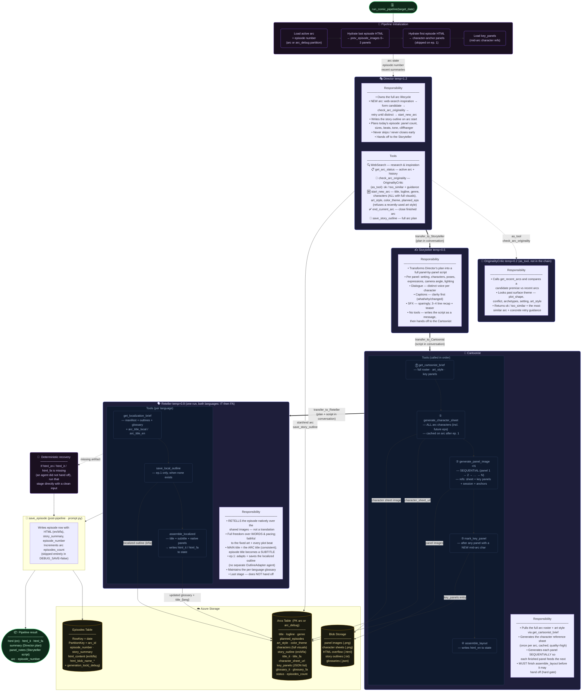

# ComicBook Pipeline — Agent Flow

`run_comic_pipeline` is a **single `Runner.run(Director)`** whose control flows by OpenAI
Agents-SDK **handoffs**: Director → Storyteller → Cartoonist → Reteller. A deterministic recovery
re-runs any stage whose output is missing, so a missed handoff never strands the comic.

> **Handoffs:** each `==>` edge is an SDK handoff (`transfer_to_<next>`) with
> `input_filter=remove_all_tools`, so the next agent inherits the plan/script **messages** but not
> the prior stage's tool calls. Every chained agent is wrapped with
> `prompt_with_handoff_instructions(...)` for reliable transfers; the Cartoonist is additionally
> hard-gated to finish `assemble_layout` before it may transfer.

## Agent Summary

| Agent | Role | Temp | Tools | In handoff chain? |
|---|---|---|---|---|
| **Director** | Arc lifecycle + originality + episode planner | 1.2 | WebSearch, get_arc_status, **check_arc_originality** (as_tool), start_new_arc, end_current_arc, save_story_outline | entry → Storyteller |
| **OriginalityCritic** | Judges a candidate arc vs recent arcs | 0.2 | get_recent_arcs | no — invoked via `as_tool` |
| **Storyteller** | Panel-by-panel script writer | 0.5 | — | → Cartoonist |
| **Cartoonist** | Image generation + HTML assembly (en) | 1.0 | get_cartoonist_brief, generate_character_sheet, generate_panel_image, mark_key_panel, assemble_layout | → Reteller |
| **Reteller** | Native retelling IT + FA (one run) | 0.9 | get_localization_brief, save_local_outline, assemble_localized | terminus |

## Key Design Decisions

| Decision | Reason |
|---|---|
| **Handoff chain + deterministic recovery** | Agents collaborate via SDK handoffs (Director→Storyteller→Cartoonist→Reteller); if a model fails to call its transfer tool, the pipeline runs the missing stage directly so a comic always ships |
| **No LLM calls inside a tool** | A `@function_tool` does only deterministic work; model-reasoning steps are Agents reached via `as_tool` (OriginalityCritic) or handoffs |
| **Three-layer originality guard** | Prompt mandates search→check→retry; the OriginalityCritic (as_tool) judges core-story similarity; `start_new_arc` refuses a recently-used art style |
| **Temperature split** | Director 1.2 (creative engine) and OriginalityCritic 0.2 (judge); Storyteller 0.5 faithfully executes the plan; Reteller 0.9 |
| Panels generated **sequentially** | Each finished panel URL feeds as a reference into the next call, maintaining visual consistency |
| Character sheet uses **ALL arc characters** at `quality=high` | Generated once on ep. 1 and cached — must cover every character who ever appears |
| **key_panels** list on the arc | Mid-arc characters get a dedicated reference panel persisted across future episodes |
| **Reteller does both languages in one run** | Retells IT then FA via tools; adapts + saves the localized outline on ep.1 itself (the separate OutlineAdapter agent was removed) |
| **Reteller retells natively** | Fragment translation forced English's text architecture onto every language; retelling lets each language restructure dialogue/captions. Box POSITIONS stay fixed (caption top, bubbles bottom, RTL-aware) |
| **Localized title from the ARC + episode subtitle** | The main title is the arc title (stored as `title_{lang}`, consistent every episode); the episode's native title is a subtitle under it |
| **Readability guard** | `_assemble_html` flips any low-contrast text color to near-black/near-white so a box is never light-on-light or dark-on-dark |
| **DEBUG / DEBUG_SAVE** | `DEBUG` isolates to an `arc_debug` partition (`debugarc_*` ids, `generation_lock_debug`) so local tests never touch production; `DEBUG_SAVE=false` is a pure dry run |
| **No generation time limit** | Chat + image clients use a 1-hour timeout (`COMICBOOK_LLM_TIMEOUT` / `COMICBOOK_IMAGE_TIMEOUT`) so slow generations are not cut off |
