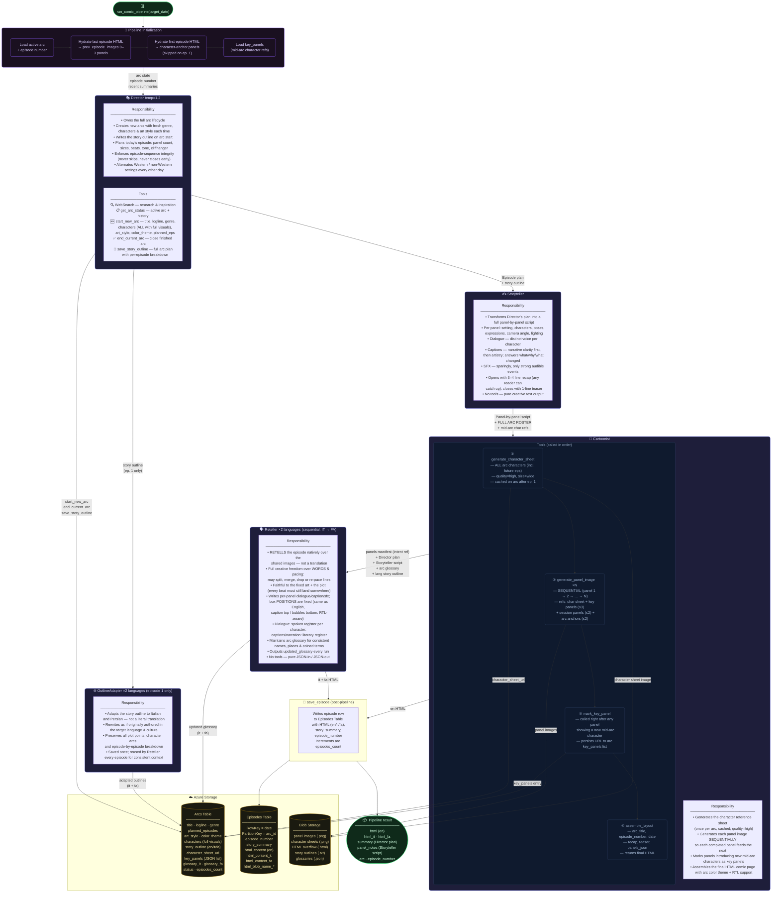

# ComicBook Pipeline — Agent Flow

## Agent Summary

| Agent | Role | Tools | Runs |
|---|---|---|---|
| **Director** | Arc lifecycle + episode planner | WebSearch, get_arc_status, start_new_arc, end_current_arc, save_story_outline | Every episode |
| **Storyteller** | Panel-by-panel script writer | — | Every episode |
| **Cartoonist** | Image generation + HTML assembly | generate_character_sheet, generate_panel_image, mark_key_panel, assemble_layout | Every episode |
| **Reteller** | Native retelling + box placement (IT + FA) | — | Every episode × 2 |
| **OutlineAdapter** | Adapts story outline to target language | — | Episode 1 only × 2 |

## Key Design Decisions

| Decision | Reason |
|---|---|
| Panels generated **sequentially** | Each completed panel URL feeds as a reference into the next call, maintaining visual consistency |
| Character sheet uses **ALL arc characters** (incl. future eps) at `quality=high` | Generated once on ep. 1 and cached — must cover every character who ever appears |
| **key_panels** list on arc entity | Mid-arc characters (not on original sheet) get a dedicated reference panel persisted across all future episodes |
| **prev_episode_images** = last ep. panels + first ep. panels | Last episode for immediate continuity; first episode as the character-introduction visual anchor |
| **OutlineAdapter** runs on ep. 1 only | Adapts the outline once per arc; the Reteller reads it every episode for consistent story context |
| Retellings run **sequentially** (IT → FA) | Avoids race conditions on glossary writes to the Arcs Table |
| **Reteller** retells natively per language | Fragment-by-fragment translation forced English's text architecture onto every language; retelling lets each language restructure dialogue/captions to read natively. Box POSITIONS stay fixed (caption top, bubbles bottom, RTL-aware) — same as English — only the words change |
