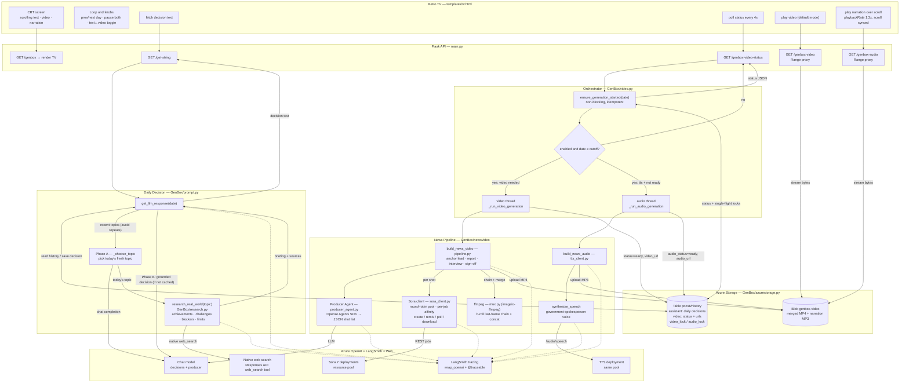
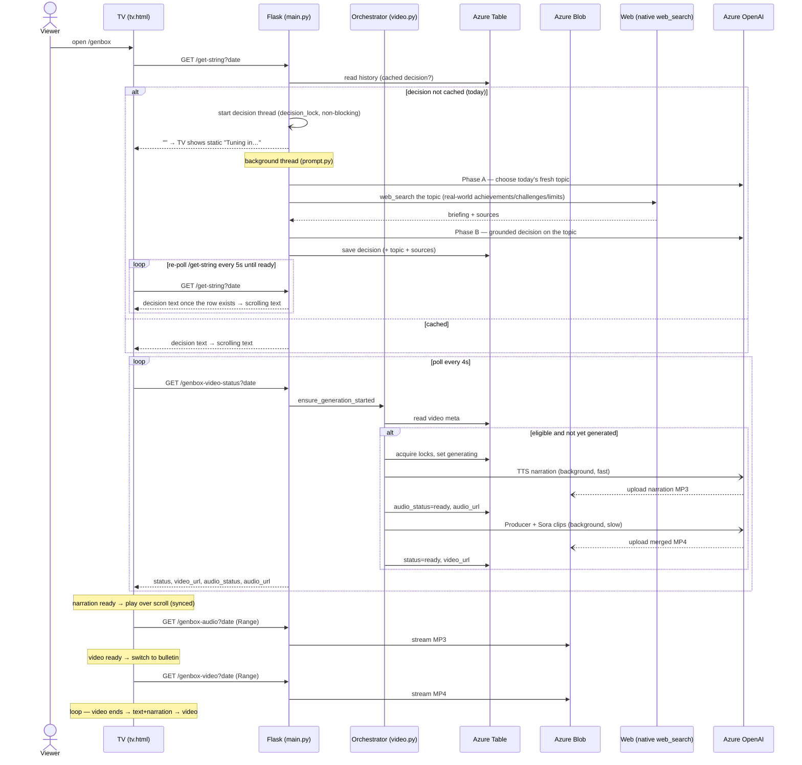
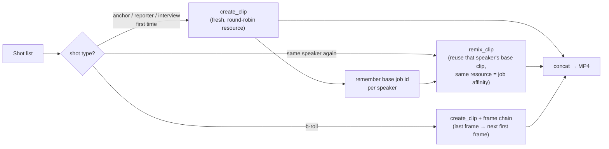

# GenBox — Technical Flow

End-to-end architecture of GenBox: the daily AI decision, the self-producing news video,
the TTS narration, storage, and the retro-TV playback. (Renders on GitHub, Mermaid Live,
and most Markdown viewers.)

## System flow

## Runtime sequence

## Per-clip consistency (Sora)

### Notes
- **Real-world grounding (two phases):** each (uncached) decision first runs **Phase A** (`_choose_topic`) — a short chat completion that picks one fresh topic for the day, diversified away from recent ones. `research_real_world` then runs a **native web search** (Azure OpenAI Responses API `web_search` tool — the same approach AIBlog uses, no third-party search API) to gather that topic's current **achievements, challenges, blockers, and limits**. **Phase B** writes the detailed decision grounded in that briefing, proposing concrete solutions to the real challenges; the chosen `topic` and exact source URLs are saved on the decision row. **Best-effort** — if web search is unavailable the decision is still generated, just ungrounded.
- **Decision vs. media gates:** text decisions are always generated; **video + narration are gated** to `date ≥ GENBOX_VIDEO_CUTOFF_DATE` and cached per date.
- **Non-blocking (text too):** the two-phase decision (topic + web research + detailed write) is slow, so it runs in a **background thread** guarded by a `decision_lock` single-flight lock — `/get-string` returns immediately and the TV shows **no-signal static** ("Tuning in…"), re-polling `/get-string` every 5s until the bulletin is ready. Video/narration are likewise produced in **background threads** guarded by **Azure Table single-flight locks**, so any gunicorn worker can serve status. (Previously the decision was generated synchronously, which could tie up a worker thread for the whole topic+research+write.)
- **Audio is decoupled from video** — narration backfills dates that already have (or are missing) a video.
- **Consistency:** Sora 2 has no seed and rejects faces in `input_reference`, so each speaker's first clip is a fresh **create** and later clips are **remixes** of it (b-roll uses last-frame chaining).
- **Same pool for everything:** decisions/producer use the chat deployment; video and TTS share the **Sora resource pool** (round-robin, per-job affinity).
