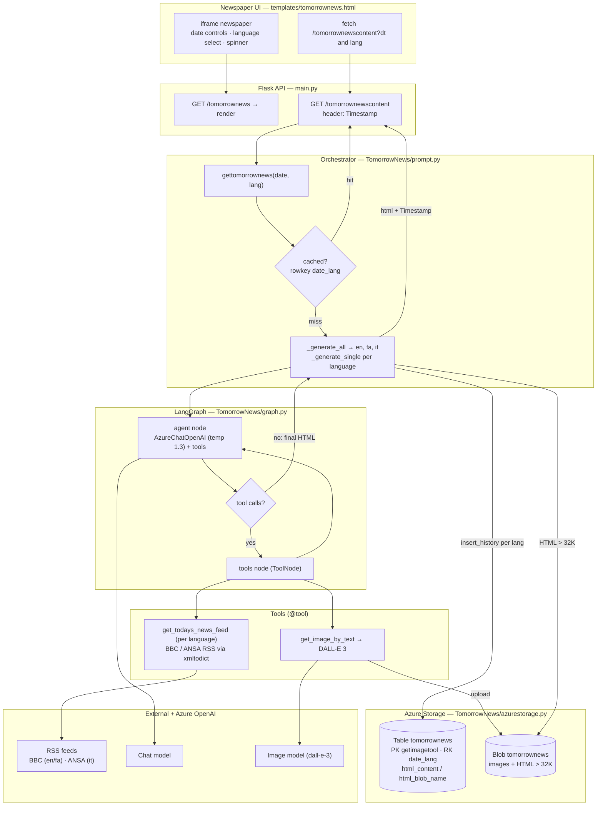
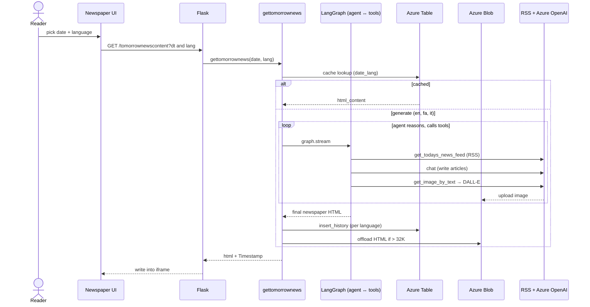

# Tomorrow News — Technical Flow

End-to-end architecture of TomorrowNews: a speculative "tomorrow's newspaper" generated daily
from real RSS headlines, with AI-written articles and images, in en/fa/it. Built on
**LangChain + LangGraph**. (Renders on GitHub, Mermaid Live, and most Markdown viewers.)

## System flow

## Runtime sequence

### Notes
- **Per-language generation:** `_generate_all` produces en → fa → it, each cached separately
  by a `date_lang` row key (PartitionKey `getimagetool`). Persian adds RTL + font directives.
- **Row-key granularity:** hourly before 2025-01-25, daily after; language UI is enabled from
  a later cutoff.
- **ReAct-style graph:** a single `agent ↔ tools` LangGraph loop — fetch RSS headlines, write
  the speculative articles, generate images — until the agent emits the final HTML newspaper.
- **Real source headlines:** BBC RSS (en/fa) and ANSA (it) parsed with `xmltodict`.
- **Images:** DALL-E 3 images are downloaded and re-uploaded to blob, embedded as ``;
  HTML over 32K chars is offloaded to blob with the name kept in the table.
- A richer multi-agent `supervisor.py` graph (Editor → Journalist → Photographer → HTML) exists
  but is **not** wired into the default route.
